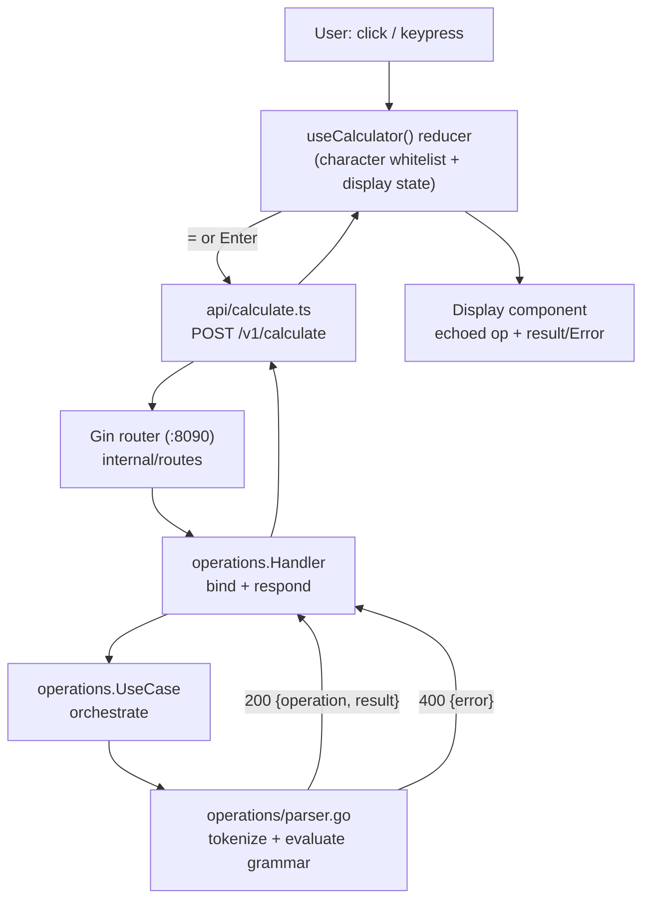

# Calculator MVP Design

**Spec**: `.specs/features/SEZ-1-calculator-mvp/spec.md`
**Status**: Draft

---

## Architecture Overview

A stateless two-service system: a React SPA (port `8080`) and a Go+Gin JSON API (port `8090`)
exposing exactly one endpoint. The frontend owns character-level input filtering and display state;
the backend owns the entire grammar (parsing, evaluation, rounding) and is the sole source of truth
for validity. No database, cache, or auth exists anywhere in the system — every request is an
independent, side-effect-free computation.



Both services are built, containerized, and composed independently (`docker-compose.yml`), matching
the fixed ports from grilling (`8080` frontend / `8090` backend, chosen to avoid the local k3d
cluster's bound `80/443/5432/5001/6443`).

---

## Code Reuse Analysis

Greenfield repository — nothing to import directly. The following **patterns** are replicated in
shape (not copied verbatim) from `~/Projects/Personal/dinherim` and `~/Projects/Personal/applyr`,
per spec.md's Technical Constraints:

### Patterns Replicated

| Pattern | Reference source | How it's applied here |
| ------- | ----------------- | ---------------------- |
| Per-slice layout (`handler.go` + `usecase.go`, colocated `_test.go`) | `dinherim/internal/health/`, `applyr/backend/internal/calendar/` | `internal/operations/` — handler + usecase, no `domain.go`/`repository.go` (no persistence to abstract) |
| Route registration on a versioned group, never the bare engine | `dinherim/internal/routes/routes.go` (AD-002 lesson in that repo) | `internal/routes/routes.go` registers `POST /v1/calculate` on `app.Group("/v1")` |
| Shared error envelope (`ErrorResponse{Error string}`) | `dinherim/internal/shared/http/response/response.go`, `applyr` same path | `internal/shared/http/response/response.go` — identical shape, reused for both format and math 400s |
| Swagger (`swaggo/gin-swagger`) + ReDoc (`go-redoc`), embedded `swagger.json` | `dinherim/internal/routes/routes.go`, `dinherim/docs/embed.go` | Same wiring; **no `SwaggerAuth` wrapper** (deviation — API-06 means these docs are intentionally open, unlike the references' gated docs) |
| `newTest<Thing>(t)` constructor helper per test file | `applyr/backend/internal/application/usecase_test.go` (`newTestUseCase`) | `newTestHandler(t)` / `newTestUseCase(t)`, adapted to build directly with no `sqlmock`/GORM (no DB exists) |
| `internal/shared/config`, `internal/shared/logger`, `main.go` Gin bootstrap | `dinherim/internal/shared/config/config.go`, `dinherim/main.go` | Same shape, trimmed to only the fields this project needs (no DB/Swagger-auth fields) |

### Deliberately NOT Replicated

| Reference element | Why it's excluded here |
| ------------------ | ----------------------- |
| `internal/health` (liveness slice) | Not requested by spec.md; no `HEALTH-*` requirement exists — adding it would be scope creep |
| `internal/shared/db`, `internal/shared/di`, `NoopAuth`, `Pagination`, `QueryTimeout` middleware | All exist in the references only to support persistence/auth/lists, which this project explicitly excludes (Out of Scope table) |
| `SwaggerAuth` middleware | API-06: no auth mechanism exists anywhere in this service, including on its docs |
| Generic `ErrorStatus`/`HandleUseCaseError` sentinel→status dispatcher (`applyr/backend/internal/shared/http/response/errors.go`) | That dispatcher exists to fan a domain's errors out to 404/409/422/500 etc. This slice has exactly two outcomes (200 success, 400 for every error). A `for`-loop status table adds a layer of indirection with nothing to select between — direct `c.JSON(400, ...)` on any usecase error is simpler and equally testable. See Tech Decisions. |

---

## Components

### Backend: `internal/operations/` (the single slice)

- **Purpose**: Own the entire `POST /v1/calculate` contract — HTTP binding, grammar parsing,
  evaluation, rounding, error classification.
- **Location**: `backend/internal/operations/`
- **Files**:
  - `handler.go` — Gin handler + swaggo annotations. Binds `{"operation": string}`, calls the
    usecase, maps any error to `400 {"error": "<message>"}`, otherwise `200 {"operation", "result"}`.
  - `usecase.go` — `Calculate(operation string) (json.Number, error)`: thin orchestration —
    delegates parsing+evaluation to `parser.go`, then rounds/formats the result. Kept separate from
    `parser.go` because it is a distinct responsibility (numeric presentation) that will need its
    own focused tests independent of grammar correctness.
  - `parser.go` — the grammar engine (tokenizer + left-to-right evaluator). See **Grammar & Parser
    Design** below. Not split into a sub-package: one slice, one cohesive algorithm, no reuse target
    outside this slice — a nested package would be pure ceremony (Simplicity First).
  - `errors.go` — sentinel errors (`ErrEmptyExpression`, `ErrInvalidCharacter`,
    `ErrMalformedExpression`, `ErrDivideByZero`, `ErrNegativeSqrt`, `ErrNonFiniteResult`). All map to
    `400`; kept distinct only so tests can assert *which* rule fired (`errors.Is`), not to drive
    different HTTP statuses.
  - `handler_test.go`, `usecase_test.go`, `parser_test.go` — colocated, table-driven.
- **Interfaces**:
  - `func NewHandler(uc *UseCase) *Handler`
  - `func (h *Handler) Calculate(c *gin.Context)` — `@Router /v1/calculate [post]`
  - `func NewUseCase() *UseCase` (no dependencies — stateless, nothing to inject)
  - `func (uc *UseCase) Calculate(operation string) (json.Number, error)`
  - `func evaluate(expr string) (float64, error)` — package-private, called only by `usecase.go`
- **Dependencies**: `internal/shared/http/response` (envelope), Gin, stdlib `math`/`strconv`.
- **Reuses**: response envelope pattern (see Code Reuse Analysis).

### Backend: Shared Plumbing

| Component | Location | Purpose |
| --------- | -------- | ------- |
| `Config` | `backend/internal/shared/config/config.go` | `APIPort` (default `8090`), `AppEnv`, `GinMode`, `LogLevel` — env-driven, validated at boot, no DB/Swagger-auth fields |
| `response.ErrorResponse` | `backend/internal/shared/http/response/response.go` | `{Error string \`json:"error"\`}` — the one error shape used everywhere |
| `logger.Initialize(appEnv)` | `backend/internal/shared/logger/logger.go` | `slog`-based structured logger (Assumptions: "basic structured logging only, no metrics/tracing") |
| `middleware.RequestContext` | `backend/internal/middleware/request_context.go` | Attaches a request ID + scoped logger to `context.Context`, mirroring the references' convention, so a failed calculation is traceable in logs |
| `middleware.SecurityHeaders` | `backend/internal/middleware/security_headers.go` | Baseline hardening headers (same as both references) — cheap, no persistence/auth coupling |
| `middleware.RequestTimeout` | `backend/internal/middleware/request_timeout.go` | Bounds request duration — basic server hygiene, no DB/query timeout needed since there's nothing to query |
| `middleware.CORS` | `backend/internal/middleware/cors.go` | **New — not present in either reference.** Both references are same-origin or ingress-fronted; this project's browser calls `:8090` directly from a page served on `:8080`, which is cross-origin. See Risks & Concerns. |
| `routes.Routes(app, v1, uc, cfg)` | `backend/internal/routes/routes.go` | Registers `POST /v1/calculate` on the `v1` group; registers `/swagger/*any` and `/docs` (no auth wrapper) |
| `main.go` | `backend/main.go` | Boots `slog`, builds the Gin engine (`Recovery`, `SecurityHeaders`, `CORS`, `RequestTimeout`, `RequestContext`), registers routes, starts `http.Server` on `cfg.APIPort` with graceful shutdown |

### Frontend Components

```
frontend/src/
├── App.tsx                     — mounts CalculatorApp + HelpModal, owns modal open/close state
├── hooks/useCalculator.ts       — the state machine (see State Management below)
├── api/calculate.ts             — POST /v1/calculate client + typed request/response
├── components/
│   ├── CalculatorApp.tsx        — layout shell (card), composes Display + ButtonGrid + HelpButton
│   ├── Display.tsx              — echoed operation (small) above result/Error (large)
│   ├── ButtonGrid.tsx           — digit/operator/control buttons, purely presentational
│   ├── HelpButton.tsx           — "?" control, top-right
│   └── HelpModal.tsx            — shortcut list, closes on click or Escape
└── styles/tokens.css             — CSS custom properties (see Design Tokens below)
```

- **`useCalculator()`** — **Purpose**: single source of truth for expression/display/error state and
  all input handling (click + keyboard). **Interfaces**:
  - `state: { status: 'composing'|'result-shown'|'error-shown', expression: string, echoedOperation: string, displayValue: string }`
  - `inputChar(c: string): void` — digit or one of the 7 operator/postfix characters
  - `inputDecimal(): void` — same as `inputChar('.')` plus leading-zero auto-prefix
  - `toggleSign(): void`, `backspace(): void`, `clear(): void`, `submit(): void`
  - **Dependencies**: `api/calculate.ts`. **Reuses**: nothing pre-existing (greenfield); internal only.
- **`api/calculate.ts`** — **Purpose**: typed fetch wrapper, one function.
  - `calculate(operation: string): Promise<{operation: string; result: number}>` — throws a typed
    `CalculateError` on any non-2xx, carrying the server's `error` message.
- **`CalculatorApp` / `Display` / `ButtonGrid` / `HelpButton` / `HelpModal`** — presentational only,
  receive state + handlers as props from `useCalculator()`; no component holds its own calculation
  state (single source of truth, easy to unit-test the hook independent of rendering).

---

## Grammar & Parser Design

### Formal Grammar (restated from grilling-session.md, EBNF)

```
Expression := Term (BinaryOp Term)*
Term       := Sign? Digit+ ('.' Digit+)? UnaryOp*
Sign       := '-'
BinaryOp   := '+' | '-' | '*' | '/' | '^'
UnaryOp    := '\' | '%'
Digit      := '0'..'9'
```

Evaluation is strictly left to right, no precedence, no parentheses. `UnaryOp`s are postfix and bind
only to the `Term` they're attached to (never to a running total).

### Algorithm — single-pass, no AST

The grammar has no nesting, so it parses and evaluates in one linear pass with two cooperating
routines, both in `parser.go`:

**`parseTerm(expr, pos)`** — called only at *operand-start positions* (position 0 of the whole
expression, or immediately after consuming a `BinaryOp`):

1. If the current char is `-`, consume it as `Sign` and advance.
2. Require one or more digits (`Digit+`). Zero digits here → `ErrMalformedExpression`.
3. If the current char is `.`, consume it and require one-or-more digits after it. Zero digits after
   `.` → `ErrMalformedExpression` (rejects raw `.5` / `5.`).
4. `strconv.ParseFloat` the consumed literal (sign included) → the `Term`'s numeric value.
5. While the current char is `\` or `%`, consume it and apply immediately to the `Term`'s own value,
   in written order: `%` → `value / 100`; `\` → `math.Sqrt(value)`, but first check `value < 0` →
   `ErrNegativeSqrt`. After each postfix op, check `math.IsInf`/`math.IsNaN` → `ErrNonFiniteResult`.
6. Return the final value and the new position.

**`parseExpression(expr)`**:

1. Reject `""` up front → `ErrEmptyExpression`.
2. Scan once for any rune outside `0-9 . + - * / ^ \ %` (including whitespace) → `ErrInvalidCharacter`
   (a distinct, clearer message than an incidental grammar-mismatch error further down).
3. Call `parseTerm` at position 0 → first term.
4. Loop: if the string isn't exhausted, the current char **must** be a `BinaryOp` — anything else
   (a second postfix char, a stray `.`, end-of-string reached mid-term) → `ErrMalformedExpression`.
   Consume the `BinaryOp`, then call `parseTerm` again (now at the position right after a
   `BinaryOp` — exactly the operand-start context `parseTerm` needs to legally consume a `Sign`).
5. Collect all term values and the `BinaryOp`s between them.
6. Fold left to right: `result := terms[0]`; for each `(op, term)` pair, apply `op` to
   `(result, term)`. `/` with a zero right-hand side → `ErrDivideByZero`. After every fold step,
   check finiteness → `ErrNonFiniteResult` (catches overflow like `9999999999^9999999999`).

**Why this elegantly satisfies the contextual-sign rule for free:** `parseTerm` is *only ever
invoked* at the start of the expression or immediately after consuming a `BinaryOp` character — so
"is `-` a sign or an operator" never needs an explicit lookahead/lookbehind rule. It falls out of
*when* `parseTerm` is called. A second consecutive `-` (`5---3`) parses as: Term `5`, `BinaryOp -`,
then `parseTerm` at the second `-` consumes it as `Sign`, then finds a **third** `-` where a digit is
required → `ErrMalformedExpression` — no special-case code needed for "double sign," it's a direct
consequence of `Term`'s `Digit+` requirement.

### Worked Examples (from spec.md's edge cases, verified by hand)

| Input | Result |
| ----- | ------ |
| `2+2` | `4` |
| `16\%` | sqrt(16)=4, then 4/100 → `0.04` |
| `5--3` | Term `5`, op `-`, Term `-3` → `5 - (-3)` → `8` |
| `-5+3` | Term `-5`, op `+`, Term `3` → `-2` |
| `5---3` | `ErrMalformedExpression` (third `-` where a digit is required) |
| `+5` / `*5` / `/5` / `^5` | `ErrMalformedExpression` (no valid left operand — `parseTerm` at pos 0 doesn't consume non-`-` `BinaryOp`s as `Sign`) |
| `\5` / `%5` | `ErrMalformedExpression` (`UnaryOp` can't start a `Term`) |
| `5+*3` | `ErrMalformedExpression` (after `BinaryOp +`, `parseTerm` finds `*`, not a sign/digit) |
| `1+1+` | `ErrMalformedExpression` (trailing `BinaryOp`, `parseTerm` finds end-of-string) |
| `1.2.3` | `ErrMalformedExpression` (second `.` isn't a valid `BinaryOp` after the first Term) |
| `.5` / `5.` (raw) | `ErrMalformedExpression` (`Digit+` required on both sides of `.`) |
| `5/0` | `ErrDivideByZero` |
| `-4\` | `ErrNegativeSqrt` (Term's own value is `-4` before the postfix op applies) |
| `9999999999^9999999999` | `ErrNonFiniteResult` (`math.Pow` overflows to `+Inf`) |

### Rounding & Number Formatting (CALC-10, API-01/02)

`result` must be JSON-numeric (not a string), rounded to 10 significant digits, trailing zeros
trimmed, **never** scientific notation. Go's default `float64` JSON marshaling can emit scientific
notation for extreme magnitudes, so the response uses `encoding/json.Number` (a string-backed type
that `encoding/json` marshals as a raw, unquoted number literal) instead of a bare `float64`:

```go
func formatResult(v float64) (json.Number, error) {
    if math.IsInf(v, 0) || math.IsNaN(v) {
        return "", ErrNonFiniteResult
    }
    rounded := roundToSignificantDigits(v, 10)
    s := strconv.FormatFloat(rounded, 'f', -1, 64) // 'f' verb never produces scientific notation
    return json.Number(trimTrailingZeros(s)), nil
}
```

`roundToSignificantDigits` uses the standard `magnitude := 10^(digits - ceil(log10(|v|)))` /
`round(v*magnitude)/magnitude` technique. `strconv.FormatFloat(..., 'f', -1, 64)` already produces
the shortest round-trip fixed-point representation (no scientific notation, ever, by definition of
the `'f'` verb); `trimTrailingZeros` is a small defensive pass for the rare case rounding produces an
exact trailing-zero literal.

---

## API Contract

**`POST /v1/calculate`** — the only endpoint.

**Request**:

```json
{ "operation": "2+2" }
```

**Response `200`**:

```json
{ "operation": "2+2", "result": 4 }
```

`operation` echoes the request's original string verbatim (not reformatted). `result` is a JSON
number (see Rounding above).

**Response `400`** (format error or math error — same envelope):

```json
{ "error": "operations: expression does not match the grammar" }
```

| Requirement | Contract detail |
| ----------- | ---------------- |
| API-01/02 | `200` body is exactly `{"operation": string, "result": number}` |
| API-03/04/05 | Any invalid character, grammar mismatch, malformed JSON, missing/non-string `operation` → `400` with `{"error": string}` |
| API-06 | No header, cookie, or token is inspected anywhere in the request path |
| API-07 | `GET /swagger/*any` and `GET /docs` serve interactive docs listing this route, unauthenticated |

Request/response bodies are `application/json` in both directions — no custom headers (per
Assumptions).

---

## Error Handling Strategy

| Error Scenario | Handling | User Impact |
| -------------- | -------- | ----------- |
| Empty expression | `ErrEmptyExpression` → `400` | FE: "Error", requires AC |
| Character outside `0-9 . + - * / ^ \ %` | `ErrInvalidCharacter` → `400` | Same (FE never sends this itself — only reachable via direct API calls, since FE whitelists at input time) |
| Any other grammar mismatch (double sign, leading binop, double binop, trailing binop, double decimal, bare `.`) | `ErrMalformedExpression` → `400` | Same |
| Division by zero | `ErrDivideByZero` → `400` | Same |
| `\` applied to a negative `Term` value | `ErrNegativeSqrt` → `400` | Same |
| Non-finite result (overflow, e.g. extreme `^`) | `ErrNonFiniteResult` → `400` | Same |
| Malformed JSON body / missing or non-string `operation` | Gin `ShouldBindJSON` bind error → `400` | Same |
| Any unexpected internal error (should not occur — no I/O, no partial state) | Not modeled — `evaluate`/`formatResult` are total functions over a validated grammar; nothing left to hit a generic 500 path | N/A |

Every `400` uses `response.ErrorResponse{Error: err.Error()}` directly in `handler.go` — no
status-dispatch table (see Tech Decisions).

---

## Frontend: State Management

`useCalculator()` is a single `useReducer` (no Context, no Zustand/Redux — one hook, one consuming
component tree, nothing to share across distant components — see Tech Decisions).

**States**: `composing` → `result-shown` → (`composing` on next digit, or continues on next
operator) ; any state → `error-shown` on a failed `submit()` ; `error-shown` → `composing` only via
`clear()`.

```mermaid
stateDiagram-v2
    [*] --> composing
    composing --> composing: digit/operator/./±/backspace
    composing --> result-shown: submit() → 200
    composing --> error-shown: submit() → 400
    result-shown --> composing: digit (fresh start, FE-10)
    result-shown --> composing: operator (continue from prior result, FE-10)
    error-shown --> composing: clear() [AC only, FE-09]
    composing --> composing: clear()
    result-shown --> composing: clear()
```

**Reducer actions** → **guards** (per Assumptions' "Backspace/± scope" + FE-09/10):

| Action | Valid in `composing` | Valid in `result-shown` | Valid in `error-shown` |
| ------ | :---: | :---: | :---: |
| digit char | append | discard result, start fresh (FE-10) | ignored |
| operator/postfix char | append | prefix with previous result, then append (FE-10) | ignored |
| `.` | append (+ auto-zero) | discard result, start fresh with `"0."` | ignored |
| `±` | toggle sign on current operand | ignored | ignored |
| backspace | delete last char | ignored | ignored |
| `=`/Enter | `calculate()` if non-empty | no-op (nothing to submit) | ignored |
| AC / Escape | reset | reset | reset (only way out) |

**Keyboard mapping** (FE-02/03/04): a single `window.keydown` listener (registered once in
`useCalculator`, not per-button) filters to `0-9 . + - * / ^ \ % Enter Backspace Escape` and dispatches
the same actions the buttons use — no separate code path, so button and keyboard behavior can never
drift. `Escape` closes the help modal if open; otherwise it resets the same way "AC" does (revised
post-launch: an initial Design-phase default of "Escape is whitelisted but inert" left error-shown
recoverable only by mouse, which UAT flagged as a real gap — `isHelpOpen` is threaded into
`useCalculator` so Escape can't fire AC underneath an open modal). `-` on the
keyboard always appends a literal `-` character (same as clicking a `-` button would, if one
existed) — **there is no keyboard binding for `±`**, per grilling ("no new typed keyboard shortcut is
introduced").

---

## Design Tokens (for `/design` skill, OPS-11)

Derived from `/Users/flaviostudart/Desktop/ui-reference.png` (viewed directly this session — a dark
job-tracker UI, used **only** as a color source, per FE-15) as CSS custom properties in
`frontend/src/styles/tokens.css`. These are a starting proposal — the `/design` skill (Claude Design
system `seezle-technical-assesment`) owns final exact values and applies them across the actual
component visuals; this table exists so it has named, semantic hooks to target rather than starting
from nothing.

| Token | Proposed value | Source | Mandatory use |
| ----- | --------------- | ------ | -------------- |
| `--color-bg` | `#0B0E14` (near-black/navy) | Reference image page background | Calculator app background |
| `--color-surface` | `#1A1F2E` (slate) | Reference image card fill | Calculator body / non-operator buttons |
| `--color-surface-raised` | `#232A3D` | Lightened surface | Hover/press states |
| `--color-accent` | `#3B82F6` (blue) | Reference image selected-card border | Operator buttons (`+ - * / ^`), focus rings |
| `--color-danger` | `#EF4444` (red) | Reference image oldest-status badge | **AC and `=` buttons — mandatory, FE-07** |
| `--color-warning` | `#F59E0B` (amber) | Reference image mid-age status badge | Available for postfix-op buttons (`\ %`) or secondary emphasis — `/design`'s discretion |
| `--color-success` | `#22C55E` (green) | Reference image freshest-status badge | Available for a success micro-interaction (e.g. result-shown flash) — not required |
| `--color-text-primary` | `#F5F7FA` | Reference image heading text | Large result value |
| `--color-text-secondary` | `#8B93A7` | Reference image secondary text | Small echoed-operation line |

Layout takes `/Users/flaviostudart/Desktop/calculator.png` (macOS Calculator, also viewed this
session) as its structural base per FE-16: echoed operation small above a large result, a top utility
row (backspace / AC / postfix ops), a right-hand operator column, digit grid below, `±` and `.`
grouped with `0` at the bottom. Our operator set (7 symbols vs. macOS's 4) means the exact grid
arrangement is a `/design`-skill decision, not fixed here — this design only guarantees every
required element (echoed op, result, backspace, decimal, sign-toggle, AC/`=` in red, "?" top-right)
has a place.

---

## Swagger/OpenAPI Setup

Same toolchain as both references: `swaggo/swag` CLI generates `backend/docs/{docs.go,swagger.json,swagger.yaml}`
from the `handler.go` annotations + a `main.go` `@title`/`@version`/`@BasePath` block;
`backend/docs/embed.go` embeds `swagger.json` for `go-redoc`. `routes.go` registers:

- `GET /swagger/*any` → `ginSwagger.WrapHandler(swaggerFiles.Handler)` (Swagger UI)
- `GET /docs` and `GET /docs/openapi.json` → `go-redoc` (ReDoc), `SpecFS: &docs.SwaggerJSON`

Both routes are registered with **no auth middleware** (deviation from both references — API-06
means there is nothing to gate). `@BasePath` is `/v1`.

---

## Docker/Compose Layout

```
backend/Dockerfile     — multi-stage: golang:<pinned-at-Execute> builder → distroless/alpine runtime,
                          CGO_ENABLED=0, EXPOSE 8090, ENTRYPOINT the compiled binary
frontend/Dockerfile    — multi-stage: node:<pinned-at-Execute> builder (`npm run build`) →
                          nginx:alpine serving the static `dist/`, EXPOSE 8080
docker-compose.yml     — two services, no shared network config beyond compose's default bridge
```

Exact base-image tags (Go/Node versions) are deliberately not pinned by this design — they are
verified against the toolchain actually in use at Execute time (`go.mod`'s `go` directive,
`package.json`'s `engines`), not guessed from training data, per the Knowledge Verification Chain.

```yaml
services:
  backend:
    build: ./backend
    ports: ["8090:8090"]
    environment:
      - API_PORT=8090
      - APP_ENV=production
      - GIN_MODE=release
      - LOG_LEVEL=info
  frontend:
    build:
      context: ./frontend
      args:
        VITE_API_BASE_URL: http://localhost:8090
    ports: ["8080:8080"]
    depends_on: [backend]
```

The frontend bakes `VITE_API_BASE_URL` in at build time (Vite env vars are build-time constants) —
acceptable because both ports are contractually fixed by this spec, so there is no runtime
reconfiguration need. `frontend/src/api/calculate.ts` reads
`import.meta.env.VITE_API_BASE_URL ?? 'http://localhost:8090'`.

---

## Test Strategy (mapped to Requirement IDs)

### Backend

| Test file | Type | Covers |
| --------- | ---- | ------ |
| `parser_test.go` | unit (table-driven) | CALC-01..11 and every grammar edge case in spec.md's Edge Cases section — one row per input/expected-(value or sentinel-error) pair |
| `usecase_test.go` | unit | CALC-10, API-01/02 — rounding to 10 sig figs, trailing-zero trim, no-scientific-notation formatting; error pass-through from `parser.go` |
| `handler_test.go` | integration (`httptest` + real Gin router, no mocks — see spec.md Assumptions "Meaning of integration test") | API-03..06 — full HTTP round trip: valid request → `200` with exact body shape; malformed JSON / missing `operation` / non-string `operation` → `400`; no-credentials request still processed (API-06) |
| `routes_test.go` | integration | API-07 — `GET /swagger/index.html` and `GET /docs` return non-404 |

### Frontend

| Test file | Type | Covers |
| --------- | ---- | ------ |
| `useCalculator.test.ts` | unit (Vitest) | FE-01..04, FE-06, FE-09..13 — reducer transitions: char accumulation, backspace, decimal auto-zero, sign toggle, AC reset, error-lock, post-result continuation vs. fresh start |
| `calculate.test.ts` | unit (Vitest, mocked `fetch`) | FE-05, FE-08, FE-09 — request shape, success parsing, error parsing |
| `CalculatorApp.test.tsx` | component (RTL) | FE-01, FE-02, FE-05, FE-07, FE-08, FE-09 — click accumulates display; keyboard accumulates display; `=`/Enter fires exactly one call; AC/`=` carry the danger token/class; result and echoed operation render; Error renders and locks input |
| `HelpModal.test.tsx` | component (RTL) | FE-14 — opens on click, closes on close-control click and on Escape |

No e2e suite (OPS-10, seed's explicit exclusion). FE-15/16/17 (palette fidelity, macOS-reference
layout, responsive/mobile) are visual concerns verified by manual QA against the two reference
images (per spec.md Success Criteria), not by an automated assertion — CSS/visual regression tooling
is not part of this scope.

---

## Requirement Traceability Crosswalk

| Requirement | Design location |
| ----------- | ---------------- |
| CALC-01, CALC-07 | `parser.go` — `parseExpression`/`parseTerm`, no-precedence left-to-right fold |
| CALC-02, CALC-03, CALC-04 | `parser.go` — postfix-op loop inside `parseTerm`, binds to that Term only |
| CALC-05, CALC-06 | `parser.go` — `parseTerm`'s call-site-only `Sign` consumption (see "Why this elegantly satisfies...") |
| CALC-08, CALC-09, CALC-11 | `parser.go` fold step (`ErrDivideByZero`) and postfix step (`ErrNegativeSqrt`); finiteness check after every op (`ErrNonFiniteResult`) |
| CALC-10 | `usecase.go` `formatResult` — rounding/trim/no-scientific-notation |
| API-01, API-02 | Handler success response shape (API Contract) |
| API-03, API-04, API-05 | `parser.go` whitelist scan + grammar errors; `handler.go` JSON-bind errors |
| API-06 | No auth middleware anywhere in `main.go`/`routes.go` |
| API-07 | `routes.go` Swagger/ReDoc registration, unauthenticated |
| FE-01, FE-02, FE-03, FE-04 | `useCalculator` — click handlers + single `window.keydown` listener, shared dispatch |
| FE-05 | `useCalculator.submit` → `api/calculate.ts` — single call per `=`/Enter press |
| FE-06, FE-07 | `useCalculator.clear`; `--color-danger` token mandatory on AC/`=` |
| FE-08, FE-09 | `Display` component; `error-shown` state guard |
| FE-10 | `composing`/`result-shown` transition table above |
| FE-11, FE-12, FE-13 | `toggleSign`/`backspace`/`inputDecimal` reducer actions |
| FE-14 | `HelpModal` component |
| FE-15, FE-16, FE-17 | Design Tokens section; layout structure notes; manual QA (no automated assertion) |
| OPS-01..09 | Documentation/delivery deliverables — content sourced from this design's API Contract, Grammar, and Design Tokens sections; produced as file-creation tasks in Tasks/Execute, no code component of their own |
| OPS-10 | Test Strategy section above |
| OPS-11 | Design Tokens section (this design's output is the `/design` skill's input, per the task's own instruction not to invoke `/design` here) |

**Coverage**: 46 total, 46 addressed by this design (0 unmapped). Tasks phase maps each to concrete
task IDs next.

---

## Risks & Concerns

| Concern | Location | Impact | Mitigation |
| ------- | -------- | ------ | ---------- |
| Cross-origin browser calls: frontend served on `:8080`, backend on `:8090` — different origins, so a bare `fetch` from the SPA to `/v1/calculate` fails the browser's same-origin policy without CORS headers. Neither reference repo has ever needed CORS (same-origin/ingress-fronted in their own deployments), so this is a genuinely new gap this design must close, not an oversight in the references. | `backend/internal/middleware/cors.go` (new) | Without it, FE-05 cannot work at all against the compose stack — every calculation would fail client-side with a CORS error before a request even leaves the browser | New `middleware.CORS` sets `Access-Control-Allow-Origin: *` (safe here — API-06 confirms no auth/cookies/credentials exist to protect) plus `Access-Control-Allow-Methods: POST, OPTIONS` and `Access-Control-Allow-Headers: Content-Type`, and short-circuits `OPTIONS` preflight with `204` |
| `strconv.FormatFloat(..., 'f', -1, 64)` on a value with many significant digits after rounding to 10 sig figs (e.g. a very large magnitude) could still produce a long digit string | `usecase.go formatResult` | Cosmetic only — still a valid, non-scientific JSON number, satisfies CALC-10 literally | None needed; flagged so Tasks-phase tests include at least one large-magnitude case asserting the string has no `e`/`E` |
| `json.Number` must itself be a syntactically valid JSON number token for `encoding/json.Marshal` to emit it unquoted rather than erroring | `usecase.go formatResult` | A malformed literal would break every successful response | `roundToSignificantDigits` + `strconv.FormatFloat('f',...)` only ever produce valid JSON-number-shaped strings (optional `-`, digits, optional `.digits`) — no path produces `+`, leading zeros, or exponents; a unit test parses every `formatResult` output back with `strconv.ParseFloat` as a round-trip guard |

---

## Tech Decisions

| Decision | Choice | Rationale |
| -------- | ------ | --------- |
| Error→status dispatch | Direct `c.JSON(400, response.ErrorResponse{Error: err.Error()})` on any usecase error, no `ErrorStatus`/`HandleUseCaseError` table | Every error in this slice maps to the same status (`400`); a generic sentinel→status dispatcher (as applyr uses for its 5-status domain) adds a layer of indirection with only one possible outcome to select — direct code is simpler and equally correct |
| Numeric response encoding | `encoding/json.Number` field instead of a bare `float64` | Guarantees fixed-point (never scientific) notation and exact-string control post-rounding, which a bare `float64`'s default JSON marshaling cannot guarantee for extreme magnitudes |
| Grammar engine shape | Single-pass `parseTerm`/`parseExpression` pair, no AST, no parser-combinator library | The grammar has no nesting/precedence — a linear scan is both the simplest and the most literal translation of the EBNF; an AST would model structure that doesn't exist in this language |
| Frontend state management | One `useReducer` in a single custom hook, no Context/Redux/Zustand | Exactly one component subtree consumes calculator state; no cross-tree sharing exists to justify a global store |
| Frontend data fetching | Plain `fetch` wrapper, no TanStack Query | One fire-and-forget mutation triggered by explicit user action — no caching, retries, or background refetch semantics apply; adding a query library would be pure overhead for a single call site |
| Frontend build/style stack | Vite + React + TypeScript + Tailwind CSS v4 (CSS custom-property tokens), Vitest + `@testing-library/react` | Vitest/RTL are the spec's explicit constraint (matches `applyr/frontend`'s test tooling); Tailwind v4 matches the same reference's styling approach and is what Claude Design (OPS-11's `/design` skill) expects to consume/refine — kept without applyr's heavier TanStack Router/Query/shadcn/react-hook-form, none of which this single-screen, single-endpoint app needs |
| No `internal/health` slice | Omitted entirely | Not requested by spec.md; adding one would be scope creep beyond the seed's single-endpoint requirement |

**Project-level decisions** (governing future features in this repo, not just this one) have been
appended to `.specs/STATE.md` as `AD-001`–`AD-004`.

---

## Tips (checklist, not part of the design)

- Reuse is king → captured above; nothing pre-existing to import, patterns replicated intentionally
- Interfaces first → every component above lists its exact function signatures
- Small components → grammar engine kept to one file because it's one cohesive algorithm, not because
  it does one thing trivially — it's the one place where "small" would mean "fragmented"
