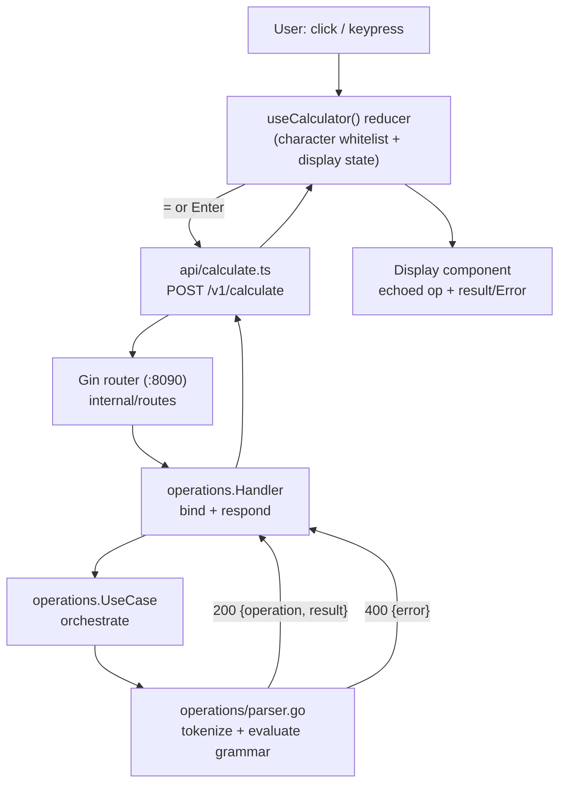

# Design

Derived from `.specs/features/SEZ-1-calculator-mvp/design.md` — see that file for the full
architecture record (Code Reuse Analysis, Tech Decisions, Risks & Concerns). This document
summarizes the intent for future sessions; it does not restate every detail.

## Architecture

A stateless two-service system: a React SPA (`:8080`) and a Go + Gin JSON API (`:8090`) exposing
exactly one endpoint. The frontend owns character-level input filtering and display state; the
backend owns the entire grammar (parsing, evaluation, rounding) and is the sole source of truth for
validity. No database, cache, or auth exists anywhere in the system.



## Backend: `internal/operations/`

The single slice owning the whole `POST /v1/calculate` contract:

| File | Responsibility |
| ---- | --------------- |
| `handler.go` | Gin handler + swaggo annotations; binds the request, calls the usecase, maps any error to `400`, otherwise `200` |
| `usecase.go` | Orchestration: delegates to the parser, then rounds/formats the result (10 significant digits, no scientific notation, `encoding/json.Number`) |
| `parser.go` | The grammar engine — single-pass tokenizer/evaluator, no AST (the grammar has no nesting) |
| `errors.go` | Sentinel errors, all mapping to `400`, kept distinct only so tests can assert which rule fired |

**Parser algorithm**: `parseTerm` is only ever invoked at the start of the expression or immediately
after a `BinaryOp`, which is what makes the contextual-sign rule (`-5+3` vs. `5--3`) fall out "for
free" with no lookahead/lookbehind — see design.md's "Why this elegantly satisfies..." note.

**Rounding**: `roundToSignificantDigits` (`magnitude := 10^(digits - ceil(log10(|v|)))`) followed by
`strconv.FormatFloat(rounded, 'f', -1, 64)`, which by definition of the `'f'` verb never produces
scientific notation, then a defensive trailing-zero trim.

## Frontend Components

```
frontend/src/
├── App.tsx                     — mounts CalculatorApp + HelpModal, owns modal open/close state
├── hooks/useCalculator.ts      — the state machine
├── api/calculate.ts            — POST /v1/calculate client + typed request/response
├── components/
│   ├── CalculatorApp.tsx       — layout shell (card), composes Display + ButtonGrid + HelpButton
│   ├── Display.tsx             — echoed operation (small) above result/Error (large)
│   ├── ButtonGrid.tsx          — digit/operator/control buttons, purely presentational
│   ├── HelpButton.tsx          — "?" control, top-right
│   └── HelpModal.tsx           — shortcut list, closes on close button, Escape, or backdrop click
└── styles/tokens.css           — CSS custom-property design tokens
```

Every component below `App.tsx` is presentational — it receives state and handlers as props from a
single `useCalculator()` call; no component holds its own calculation state.

### State Machine

`useCalculator()` is one `useReducer` — no Context, no Redux/Zustand, since exactly one component
subtree consumes calculator state.

```mermaid
stateDiagram-v2
    [*] --> composing
    composing --> composing: digit/operator/./±/backspace
    composing --> result-shown: submit() -> 200
    composing --> error-shown: submit() -> 400
    result-shown --> composing: digit (fresh start)
    result-shown --> composing: operator (continue from prior result)
    error-shown --> composing: clear() [AC only]
    composing --> composing: clear()
    result-shown --> composing: clear()
```

A single `window.keydown` listener (registered once in the hook, not per-button) dispatches the same
actions the on-screen buttons use, so button and keyboard input can never drift apart.

## UI Rationale

- **Palette**: sourced from `/Users/flaviostudart/Desktop/ui-reference.png` (a dark job-tracker UI),
  used only as a color reference — near-black background, slate surfaces, blue accent for operators,
  red reserved exclusively for the AC and `=` buttons (FE-07).
- **Layout**: structural base is `/Users/flaviostudart/Desktop/calculator.png` (macOS Calculator) —
  echoed operation small above a large result, backspace/AC/postfix ops in a top utility row, digit
  grid below, `±`/`.` grouped with `0` at the bottom, help ("?") pinned top-right.
- Design tokens live in `frontend/src/styles/tokens.css` as CSS custom properties (`--color-bg`,
  `--color-surface`, `--color-surface-raised`, `--color-accent`, `--color-danger`, `--color-warning`,
  `--color-success`, `--color-text-primary`, `--color-text-secondary`) — the same tokens the
  components consume via Tailwind's `bg-[var(--color-*)]` utilities.

## Claude Design System (Manual Follow-up)

Per the spec (OPS-11), this project's intended linked Claude Design system is named
**`seezle-technical-assesment`**. A design canvas (main calculator view + keyboard-shortcuts modal)
was produced with the `/design` skill during this session as a visual reference alongside the
hand-written React UI — it is not a replacement for the component code above.

**Linking that canvas to a named, saved Claude Design system and running `/design-sync` is a manual
follow-up the user performs themselves** — this session does not create or name a design system on
the user's behalf.

Mockup canvas published this session (main keypad view + keyboard-shortcuts modal, static reference,
tokens/layout matched against the real `tokens.css` and `ButtonGrid.tsx`/`HelpModal.tsx`):
`https://claude.ai/code/artifact/1d347362-1ca1-4bd9-9428-e60e89de3f41`

## Scope Note

Exact visual details (pixel-level spacing, final shadow/blur values) are refined visually rather than
hard-coded here; this document focuses on architecture and intent, not a frozen style guide.
